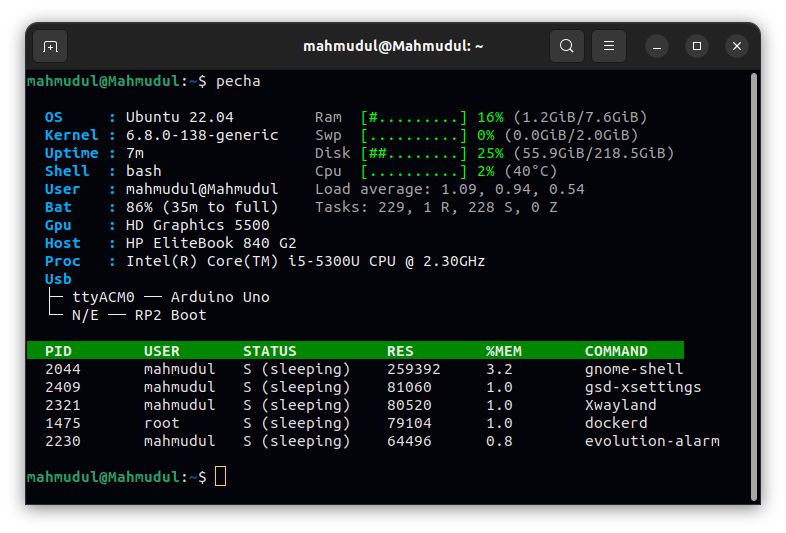

<p align="center">
  <a href="https://opensource.org/licenses/MIT"></a>
  
  <a href="https://github.com/mahmudul626/pecha/stargazers"></a>
</p>

<strong>Pecha</strong> is a fast, lightweight, and zero-dependency terminal-based system information utility built entirely from scratch. By directly leveraging Linux virtual filesystems and other system files, it offers a clean, minimal, and resource-efficient diagnostic tool free from heavy graphical dependencies.

## Features

#### System & OS Information

- OS & Kernel Details: Displays the current Linux distribution and kernel version.

- Session Tracking: Shows system uptime, active shell environment, current username, and host system name.

#### Hardware Specifications

- Processor (CPU): Detects and displays CPU model name and clock frequency.

- Graphics (GPU): Identifies the active graphics controller.

- Host Machine: Shows the manufacturer and model name.

#### Resource Monitoring & Telemetry

- Live Visual Graphs: Uses custom ASCII progress bars for RAM, Swap, Disk, and CPU usage.

- Performance Metrics: Tracks real-time memory consumption, disk occupancy, CPU load average, and live core temperature.

#### Battery & Power Status

- Battery Level: Real-time battery percentage tracking.

- Time Estimation: Calculates remaining battery life during discharge or estimated time to full charge when plugged in.

#### USB & External Device Tree

- Hardware Enumeration: Tree-structured detection of connected USB ports and hardware peripherals.

#### Process Management Table

- Task Summary: Live overview of total running tasks categorized by state (Running, Sleeping, Zombie).

- Resource-Intensive Process Table: Displays active processes sorted by resource usage, including PID, USER, STATUS, Resident Memory (RES), %MEM, and COMMAND.

## Screenshots



## Installation

#### Prerequisites

- Linux-based operating system
- `gcc` compiler
- `make` utility

#### Build from source

1. Clone or download the repository.
   ```bash
   git clone https://github.com/mahmudul626/pecha.git
   ```
2. Enter the project directory:
   ```bash
   cd pecha
   ```
3. Compile the program:
   ```bash
   make
   ```

#### System-wide installation

To install `pecha` so it can be run from anywhere:

```bash
sudo make install
```

## How it works

**pecha** reads data from the Linux kernel's virtual filesystem and other system files:

- **CPU & Hardware:** Parsed from `/proc/cpuinfo`, `/sys/class/dmi/id/product_name`, and GPU info from system files.
- **Memory & Disk:** Information from `/proc/meminfo` and `statvfs` system call for disk usage calculations.
- **Processes:** Iterates over PID directories under `/proc` and reads their `/status` files.
- **Uptime & Load:** Parsed from `/proc/uptime` and `/proc/loadavg`.
- **Power & Battery:** Reads from `/sys/class/power_supply/` for battery and power information.
- **USB Devices:** Enumerates devices from `/sys/bus/usb/devices/`.
- **Temperature:** Reads thermal zone information from `/sys/class/thermal/`.

## Uninstallation

To remove the installed binary from the system:

```bash
sudo make uninstall
```

## Contributing

Contributions are welcome! Please feel free to submit a Pull Request. For major changes, please open an issue first to discuss what you would like to change. Refer to [CONTRIBUTING.md](CONTRIBUTING.md) for more details.

## License

This project is licensed under the MIT License - see the [LICENSE](LICENSE) file for details.

## Development

- **Version:** 2.0.0
- **Language:** C
- **Platform:** Linux
- **Dependencies:** None (uses only standard C libraries and system files)

---

*pecha - Keep an eye on your system's vital signs!*

